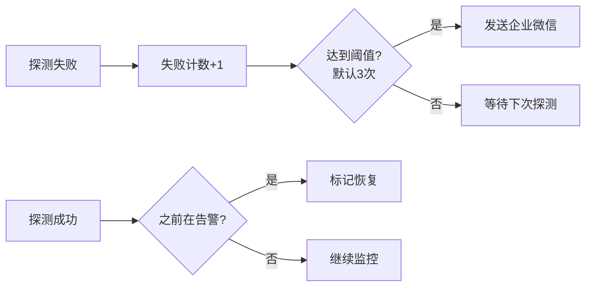
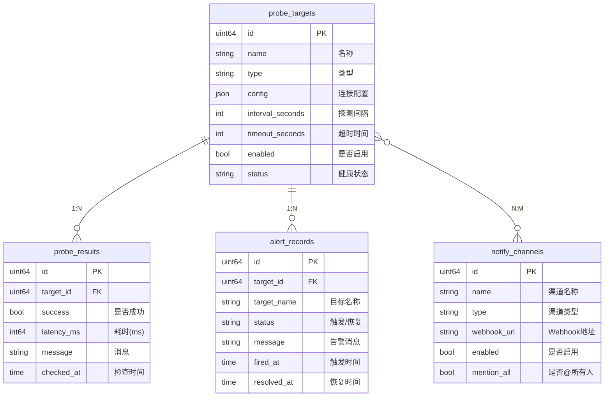
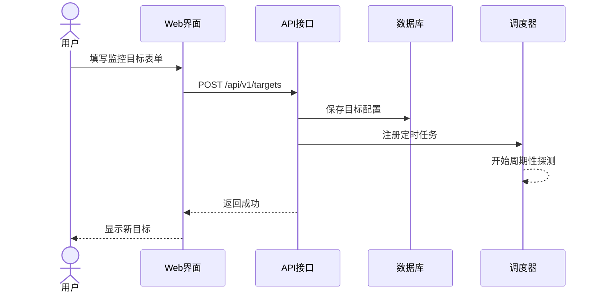
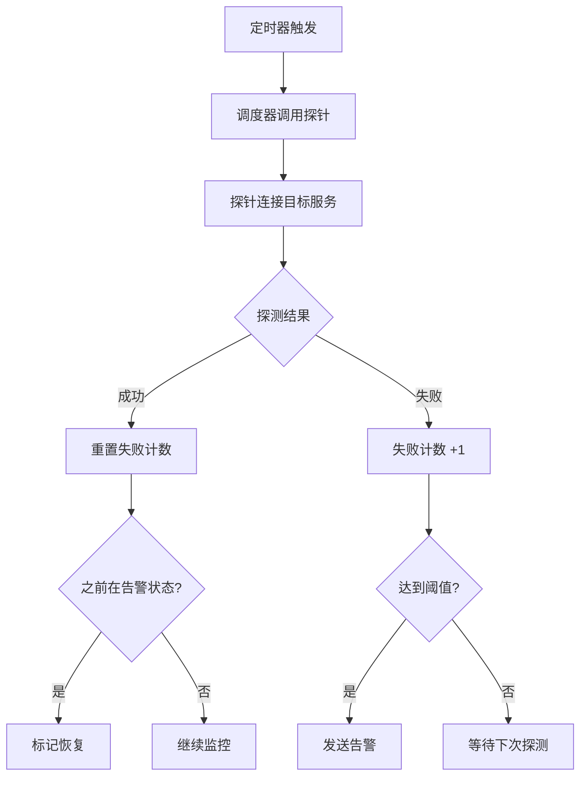
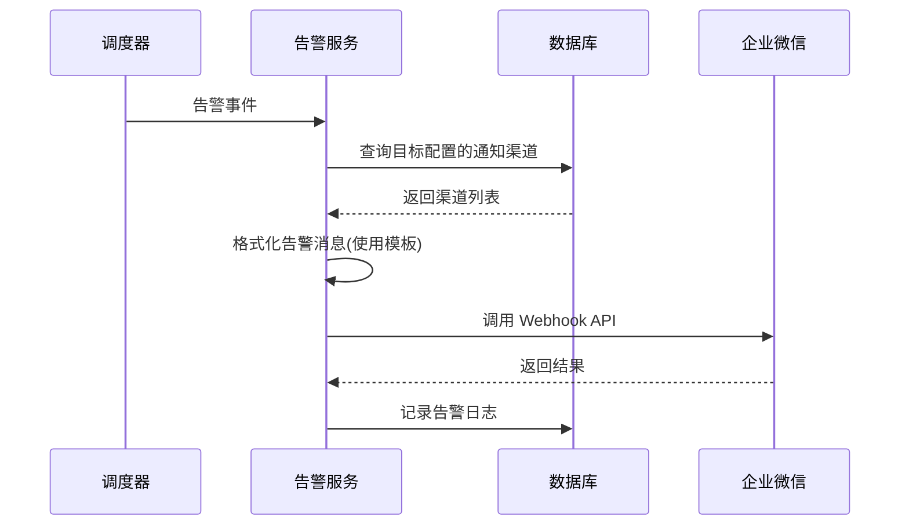
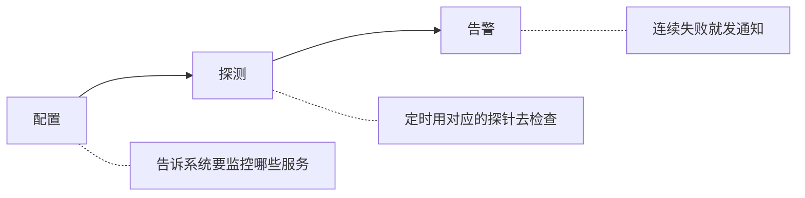

# 生产环境通用监控工具设计文档

## 1.背景

为保证生产环境中各种服务的可用性，定时检查（数据库、消息队列、HTTP接口等）各种指标是否正常，发现问题后通过企业微信告警。

---

## 2.核心概念

### 1. 监控目标（Target）

一个监控目标代表一个需要监控的服务，比如：
- 一台 PostgreSQL 数据库
- 一个 Redis 实例
- 一个 REST 接口

每个目标包含：
| 属性 | 说明 | 示例 |
|-----|------|-----|
| 名称 | 方便识别 | "生产环境-PostgreSQL" |
| 类型 | 监控类型 | postgresql |
| 配置 | 连接信息 | host、port、密码等 |
| 间隔 | 多久检查一次 | 30秒 |
| 超时 | 等多久算失败 | 5秒 |

### 2. 探针（Prober）

每种监控类型对应一种探针，探针定义如何检查这种服务：

| 探针类型 | 检查方式 |
|---------|---------|
| PostgreSQL | 连接数据库，执行 `SELECT 1` |
| Redis（集群） | 执行 `PING` 命令 |
| Kafka（集群） | 获取指定consumer_group的lag |
| HTTP | 发送请求，检查状态码 |
| TCP | 尝试建立 TCP 连接 |
| ping | 域名、IP |
| Cassandra | 集群状态 |

### 3. 调度器（Scheduler）

- 给每个目标设一个定时任务
- 定时执行对应探针
- 记录探测结果
- 连续失败达到阈值就触发告警

### 4. 告警（Alert）



---

## 3.数据模型

系统使用 4 张核心表：



---

## 4.核心流程

### 流程1：添加监控目标



### 流程2：执行探测（每 N 秒循环）



### 流程3：发送告警



---

## 5.实现

1. 创建探测目标

```go
// CreateTarget 创建探测目标 handler
func (h *ProbeHandler) CreateTarget(c *gin.Context) {
	var req model.CreateTargetRequest
	if err := c.ShouldBindJSON(&req); err != nil {
		Error(c, http.StatusBadRequest, err.Error())
		return
	}

	target, err := h.probeService.CreateTarget(c.Request.Context(), &req)
	if err != nil {
		Error(c, http.StatusInternalServerError, err.Error())
		return
	}

	Success(c, target)
}
```

```go
// CreateTarget 创建探测目标 service
func (s *ProbeService) CreateTarget(ctx context.Context, req *model.CreateTargetRequest) (*model.ProbeTarget, error) {
	// 验证探针类型
	p, ok := s.factory.Get(req.Type)
	if !ok {
		return nil, fmt.Errorf("不支持的探针类型: %s", req.Type)
	}

	// 验证配置
	target := prober.Target{
		Type:   req.Type,
		Config: req.Config,
	}
	if err := p.Validate(target); err != nil {
		return nil, fmt.Errorf("配置验证失败: %w", err)
	}

	// 序列化配置
	configJSON, err := json.Marshal(req.Config)
	if err != nil {
		return nil, fmt.Errorf("序列化配置失败: %w", err)
	}

	// 设置默认值
	if req.TimeoutSeconds <= 0 {
		req.TimeoutSeconds = 5
	}
	if req.IntervalSeconds <= 0 {
		req.IntervalSeconds = 30
	}

	// 根据 enabled 状态设置初始 status
	initialStatus := model.TargetStatusUnknown
	initialMessage := "等待首次探测"
	if !req.Enabled {
		initialStatus = model.TargetStatusDisabled
		initialMessage = "监控已禁用"
	}

	// 序列化通知渠道ID列表
	notifyChannelIDsJSON := []byte("[]")
	if len(req.NotifyChannelIDs) > 0 {
		var err error
		notifyChannelIDsJSON, err = json.Marshal(req.NotifyChannelIDs)
		if err != nil {
			return nil, fmt.Errorf("序列化通知渠道ID失败: %w", err)
		}
	}

	probeTarget := &model.ProbeTarget{
		Name:             req.Name,
		Type:             req.Type,
		Config:           configJSON,
		TimeoutSeconds:   req.TimeoutSeconds,
		IntervalSeconds:  req.IntervalSeconds,
		Enabled:          req.Enabled,
		Status:           initialStatus,
		LastMessage:      initialMessage,
		Group:            req.Group,
		NotifyChannelIDs: notifyChannelIDsJSON,
	}

	if err := s.targetRepo.Create(ctx, probeTarget); err != nil {
		return nil, fmt.Errorf("创建目标失败: %w", err)
	}

	// 如果启用，添加到调度器
	if probeTarget.Enabled {
		if err := s.scheduler.AddTask(probeTarget); err != nil {
			logger.Error("添加调度任务失败", zap.Error(err))
		}
	}

	return probeTarget, nil
}
```

```go
// repository持久层
func (r *TargetRepository) Create(ctx context.Context, target *model.ProbeTarget) error {
	return r.db.WithContext(ctx).Create(target).Error
}
```

2. 添加调度任务

```go
func (s *Scheduler) AddTask(target *model.ProbeTarget) error {
	p, ok := s.proberFactory.Get(target.Type)
	if !ok {
		return fmt.Errorf("不支持的探针类型: %s", target.Type)
	}

	// 解析配置
	var config map[string]any
	if err := json.Unmarshal(target.Config, &config); err != nil {
		return fmt.Errorf("解析配置失败: %w", err)
	}

	probeTarget := prober.Target{
		ID:       fmt.Sprintf("%d", target.ID),
		Name:     target.Name,
		Type:     target.Type,
		Config:   config,
		Timeout:  time.Duration(target.TimeoutSeconds) * time.Second,
		Interval: time.Duration(target.IntervalSeconds) * time.Second,
	}

	// 验证配置
	if err := p.Validate(probeTarget); err != nil {
		return fmt.Errorf("配置验证失败: %w", err)
	}

	task := &ProbeTask{Target: target}

	// 检查是否需要初始化 FailCount（用于正确触发恢复通知）
	// 条件：目标状态为 unhealthy，或者数据库中有未恢复的告警记录
	shouldInitFailCount := target.Status == model.TargetStatusUnhealthy
	if !shouldInitFailCount && s.alertChecker != nil {
		shouldInitFailCount = s.alertChecker.HasUnresolvedAlert(context.Background(), target.ID)
	}

	if shouldInitFailCount {
		task.FailCount = s.alertThreshold
		logger.Info("初始化失败计数（存在未恢复告警或状态异常）",
			zap.Uint64("target_id", target.ID),
			zap.String("status", target.Status),
			zap.Int("fail_count", task.FailCount),
		)
	}

	// 计算 cron 表达式
	spec := fmt.Sprintf("@every %ds", target.IntervalSeconds)

	entryID, err := s.cron.AddFunc(spec, func() {
		s.executeProbe(task, probeTarget)
	})
	if err != nil {
		return fmt.Errorf("添加定时任务失败: %w", err)
	}

	task.EntryID = entryID
	s.tasks.Store(target.ID, task)

	logger.Info("添加探测任务",
		zap.Uint64("target_id", target.ID),
		zap.String("name", target.Name),
		zap.String("type", target.Type),
		zap.Int("interval", target.IntervalSeconds),
	)

	return nil
}
```

3. 执行探测

```go
func (s *Scheduler) executeProbe(task *ProbeTask, target prober.Target) {
    ctx, cancel := context.WithTimeout(context.Background(), target.Timeout)
    defer cancel()

    p, ok := s.proberFactory.Get(target.Type)
    if !ok {
       logger.Error("探针类型不存在", zap.String("type", target.Type))
       return
    }

    result, err := p.Probe(ctx, target)
    if err != nil {
       result = &prober.ProbeResult{
          Success:   false,
          Message:   err.Error(),
          CheckedAt: time.Now(),
       }
    }

    event := &ProbeResultEvent{
       TargetID:  task.Target.ID,
       Target:    task.Target,
       Result:    result,
       Timestamp: time.Now(),
    }

    // 先同步处理告警逻辑（更新失败计数、触发告警）
    s.handleResult(event)

    // 再发送到 resultChan 供 alert_service 保存结果
    select {
    case s.resultChan <- event:
    default:
       logger.Warn("结果通道已满，丢弃结果", zap.Uint64("target_id", task.Target.ID))
    }
}
```

4. 更新失败次数、触发告警

```go
func (s *Scheduler) handleResult(event *ProbeResultEvent) {
	v, ok := s.tasks.Load(event.TargetID)
	if !ok {
		return
	}

	task := v.(*ProbeTask)
	task.mu.Lock()
	defer task.mu.Unlock()

	task.LastResult = event.Result

	if !event.Result.Success {
		task.FailCount++
		// 连续失败达到阈值时触发告警
		if task.FailCount == s.alertThreshold {
			select {
			case s.alertChan <- &AlertEvent{
				Target:    task.Target,
				Result:    event.Result,
				Status:    model.AlertStatusFiring,
				FailCount: task.FailCount,
			}:
			default:
				logger.Warn("告警通道已满", zap.Uint64("target_id", event.TargetID))
			}
		}
	} else {
		if task.FailCount >= s.alertThreshold {
			// 恢复通知
			select {
			case s.alertChan <- &AlertEvent{
				Target:    task.Target,
				Result:    event.Result,
				Status:    model.AlertStatusResolved,
				FailCount: task.FailCount,
			}:
			default:
				logger.Warn("告警通道已满", zap.Uint64("target_id", event.TargetID))
			}
		}
		task.FailCount = 0
	}
}
```

5. 探针接口

```go
// Prober 探针接口
type Prober interface {
	// Type 返回探针类型
	Type() string

	// Probe 执行探测
	Probe(ctx context.Context, target Target) (*ProbeResult, error)

	// Validate 验证目标配置
	Validate(target Target) error
}
```

6. Postgresql探针实现

```go
func (p *PostgresProber) Probe(ctx context.Context, target Target) (*ProbeResult, error) {
	start := time.Now()

	// 获取配置
	host := getStringConfig(target.Config, "host", "localhost")
	port := getIntConfig(target.Config, "port", 5432)
	username := getStringConfig(target.Config, "username", "")
	password := getStringConfig(target.Config, "password", "")
	database := getStringConfig(target.Config, "database", "thingsboard")
	sslMode := getStringConfig(target.Config, "ssl_mode", "disable")

	// 构建连接字符串
	dsn := fmt.Sprintf(
		"host=%s port=%d user=%s password=%s dbname=%s sslmode=%s connect_timeout=5",
		host, port, username, password, database, sslMode,
	)

	db, err := sql.Open("postgres", dsn)
	if err != nil {
		return &ProbeResult{
			Success:   false,
			Latency:   time.Since(start),
			Message:   fmt.Sprintf("连接失败: %v", err),
			CheckedAt: time.Now(),
		}, nil
	}
	defer db.Close()

	// 1. 基础连接检查
	if err := db.PingContext(ctx); err != nil {
		return &ProbeResult{
			Success:   false,
			Latency:   time.Since(start),
			Message:   fmt.Sprintf("Ping 失败: %v", err),
			CheckedAt: time.Now(),
		}, nil
	}

	metrics := make(map[string]any)
	var warnings []string

	// 2. 获取连接数统计
	var activeConns, maxConns int
	err = db.QueryRowContext(ctx, `
		SELECT 
			(SELECT count(*) FROM pg_stat_activity WHERE state = 'active') as active,
			(SELECT setting::int FROM pg_settings WHERE name = 'max_connections') as max
	`).Scan(&activeConns, &maxConns)
	if err == nil {
		metrics["active_connections"] = activeConns
		metrics["max_connections"] = maxConns
		metrics["connection_usage_percent"] = float64(activeConns) / float64(maxConns) * 100

		threshold := getIntConfig(target.Config, "max_connections_threshold", 100)
		if activeConns > threshold {
			warnings = append(warnings, fmt.Sprintf("连接数 %d 超过阈值 %d", activeConns, threshold))
		}
	}

	// 3. 获取数据库大小
	var dbSize string
	err = db.QueryRowContext(ctx, `
		SELECT pg_size_pretty(pg_database_size(current_database()))
	`).Scan(&dbSize)
	if err == nil {
		metrics["database_size"] = dbSize
	}

	// 4. 检查复制状态（如果是从库）
	var replicationLag sql.NullFloat64
	err = db.QueryRowContext(ctx, `
		SELECT EXTRACT(EPOCH FROM (now() - pg_last_xact_replay_timestamp()))
	`).Scan(&replicationLag)
	if err == nil && replicationLag.Valid {
		metrics["replication_lag_seconds"] = replicationLag.Float64
		if replicationLag.Float64 > 60 {
			warnings = append(warnings, fmt.Sprintf("复制延迟 %.1f 秒", replicationLag.Float64))
		}
	}

	// 5. 检查慢查询数量
	var slowQueryCount int
	err = db.QueryRowContext(ctx, `
		SELECT count(*) FROM pg_stat_activity 
		WHERE state = 'active' 
		AND query_start < now() - interval '30 seconds'
	`).Scan(&slowQueryCount)
	if err == nil {
		metrics["slow_queries"] = slowQueryCount
		if slowQueryCount > 5 {
			warnings = append(warnings, fmt.Sprintf("存在 %d 个慢查询", slowQueryCount))
		}
	}

	// 6. 获取 PostgreSQL 版本
	var version string
	err = db.QueryRowContext(ctx, "SELECT version()").Scan(&version)
	if err == nil {
		metrics["version"] = version
	}

	latency := time.Since(start)
	message := "PostgreSQL 运行正常"

	if len(warnings) > 0 {
		message = fmt.Sprintf("存在告警: %v", warnings)
	}

	// 设置 endpoint
	target.Endpoint = fmt.Sprintf("%s:%d/%s", host, port, database)

	return &ProbeResult{
		Success:   true,
		Latency:   latency,
		Message:   message,
		Metrics:   metrics,
		CheckedAt: time.Now(),
		Warnings:  warnings,
	}, nil
}
```


## 总结


